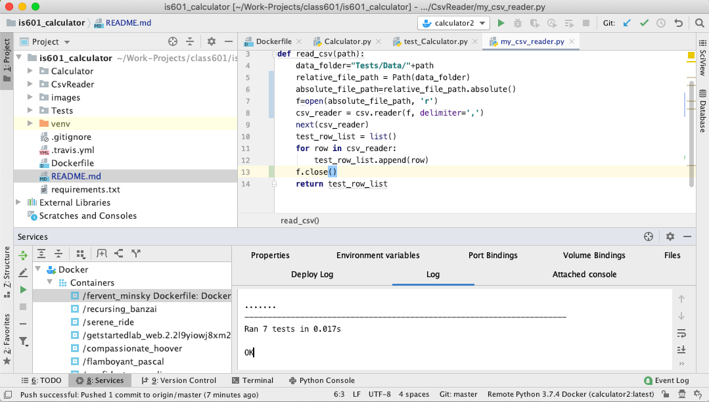

# is601_calculator

[](https://travis-ci.org/kaustavbhattacharjee/is601_calculator)

## Homework Description

For this project you need to create a calculator using Python that has automated unit tests.  Your calculator is required to perform the following operations: addition, subtraction, multiplication, division, square, and square root.  You need to correctly use static methods, object methods, object attributes / properties.   You need to use the included files to load data for your unit tests.  Use each file to test the associated operation.   

You need to make at least 7 unit tests and should develop your tests as you write the program.  For example, you should test object instantiation when you write the code to create the object.  You must not repeat code and will lose points for any code repetition.   You should try to make a commit for each successful step you take writing the program and include a unit test with that step.

## Requirements:

1. Correct usage of object and static methods and properties
1. At least 7 unit tests
1. At least 7 commits
1. Your program works
1. Your docker file is setup to run the program 

## Project Structure:

- Calculator: Contains the main Calculator.py and other definition files
- CsvReader: Contains the code to read csv
- images: Contains the images required for the project
- Tests: Contains the test files

Below is a tree structure of the project:
```bash
├── Calculator
│   ├── Calculator.py
│   └── Def_Files
│       ├── Addition.py
│       ├── Division.py
│       ├── Multiplication.py
│       ├── Square.py
│       ├── SquareRoot.py
│       ├── Subtraction.py
│       └── __init__.py
├── CsvReader
│   ├── __init__.py
│   └── my_csv_reader.py
├── Dockerfile
├── README.md
├── Tests
│   ├── Data
│   │   ├── __init__.py
│   │   ├── addition.csv
│   │   ├── division.csv
│   │   ├── multiplication.csv
│   │   ├── square.csv
│   │   ├── square_root.csv
│   │   └── subtraction.csv
│   └── test_Calculator.py

```
## Output:

The tests are running properly and below is the screenshot of the same:




